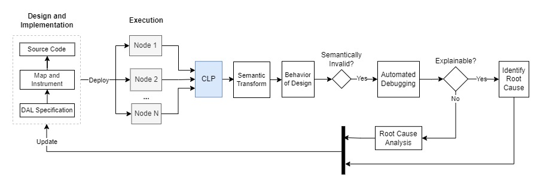

# Design Workbench

> [!NOTE]  
> This repo is in development and the features listed below are in the pipeline. Currently the application ony supports a single workspace (workspace folder in server) but this will be extended to multiple workspaces after they layout manager is migrated to event driven structure.

The Design Workbench is a Unified Development Environment (UDE) powered by design-driven [automation][automation]. At its core is an [engine][dal-engine-core-js] that enables users to formally specify designs in a Design Abstraction Language (DAL) through behaviors, participants, and semantic invariants. By mapping an implementation onto those behaviors, instrumented execution can be transformed back into the behavior defined by the design, a process known as the Semantic Transform (ST). The result is a fully automated, end-to-end diagnostic solution for software systems that is seamlessly integrated into the development process. 

## Overview

The `Design Workbench` is a full-stack system composed of a React front end and a Node.js back end. The back end hosts a workspace that is synchronized to the front end over WebSockets. The front end provides a visual interface for constructing formal designs and mapping them onto implementations. 

The backend instruments the implementation with the mapping and executes it on the chosen substrate. The resulting execution traces are preserved and are automatically debugged in the workbench by the engine. If the engine is unable to identify the root cause automatically, the workbench enters "learning" mode where behavioral modifications and new invariants are introduced. 

The traces which motivated the invariants are assigned to the invariant and serve as provable conditions to verify that an implementation enforces an invariant. As a result, the backend also acts as a fully automated testing platform where the implementation is tested to verify that it respects every invariant using the associated environments. The backend can also choose the execution substrate and assign testing or execution to remote clusters.

The workbench also provides an interface to unambiguously define the domain structure of the design data. This will be leveraged by CLP to apply domain specific compression to the data, achieving true automation by enabling the design's behavior to be retained losslessly.

This means that the workbench will contain a few unique modes:
- Design Definition
- Implementation
- Mapping
- Instrumention and Execution
- Automated Debugging
- Learning
- Automated Testing

All of these modes are intrinsic to the design feedback loop shown below and the workbench participates in this entire cycle. 



By leveraging design driven automation, the design workbench establishes the structure need to practically enable the automatic management of software systems. Ultimately, this marks the shift away from the inherent uncertainty of traditional observability platforms and marks the arrival of deterministic understanding and complete automation enabled by the Design Learning Platform (DLP).

## Development

There are two main components in this application, the server and the workbench. You can run each component independently by following the readme in each folder, or you can use the npm scripts in the root folder of the repo.

### Install Libraries

```
npm run install:all
```

### Run Both Components
```
npm run dev
```

The workbench will now be available at `http://localhost:3011/`.

### Running Components Separately

To run the components separately from root folder.
```
npm run server
```
```
npm run workbench
``` 

### Workspace

The workspace folder contains the files that will be loaded into the workbench. Currently, the application is configured to only load one design. I will extend this to multiple workspaces in an upcoming PR after making some changes to the layout manager. At that point, you will be able to create multiple workspaces, new workspaces etc.

# Providing feedback

You can use GitHub issues to [report a bug][bug-report] or [request a feature][feature-req].


[dal-engine-core-js]: https://github.com/vishalpalaniappan/dal-engine-core-js
[automation]: https://vishalpalaniappan.github.io/asp-adli-python/Automating%20the%20Management%20of%20Software%20Systems.pdf
[bug-report]: https://github.com/vishalpalaniappan/design-workbench/issues
[feature-req]: https://github.com/vishalpalaniappan/design-workbench/issues
[feature-req]: https://github.com/vishalpalaniappan/design-workbench/issues